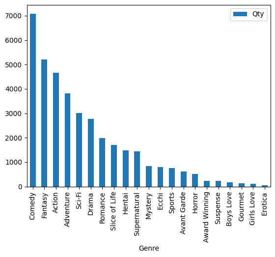
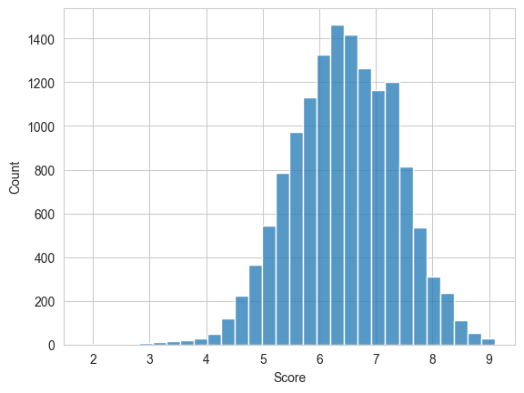
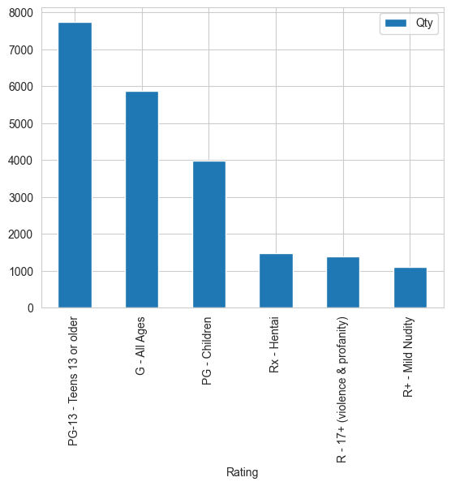

# Resultados do Projeto de Análise de Dados

## Contextualização

### Introdução
Este é um projeto de análise de dados que visa responder algumas perguntas relacionadas aos animes. Para isso foi utilizado no projeto um dataset encontrado no [kaggle](https://www.kaggle.com/datasets/dbdmobile/myanimelist-dataset/data "Dataset") contendo informações de 2023 do site [MyAnimeList](https://myanimelist.net "MyAnimeList"). Animes, como uma forma de entretenimento global, possuem uma rica diversidade em termos de gêneros, pontuações e popularidade. Com o crescente interesse em animes ao redor do mundo pode ser interessante analisar certas caracteristicas muitas vezes passadas despercebidas para o publico.

### Objetivos
- **Objetivo 1:** Identificar e analisar os gêneros de animes, determinando quais são os mais e menos comuns, além de avaliar a pontuação média de cada gênero.
- **Objetivo 2:** Analisar as estatísticas dos scores dos animes, verificar a relação entre a pontuação, popularidade e o número de episódios e analisar a distribuição dos animes por faixa etária.

### Perguntas de Pesquisa
- **Pergunta 1:** Quais gêneros são mais e menos comuns entre os animes??
- **Pergunta 2:** Quais são as estatísticas dos scores dos animes?
  - **Pergunta 2.5:** Quais são os animes que se encontram nos dois extremos de score?
- **Pergunta 3:** Existe alguma correlação entre o número de episódios e a popularidade de um anime?
- **Pergunta 4:** Os animes com maior pontuação também são os mais populares?
- **Pergunta 5:** Quais são os gêneros com a maior pontuação média?
- **Pergunta 6:** Qual é a distribuição dos animes por classificação de faixa etária?

## Resultados

#### Análise 1: Análise de Gêneros de Animes: Frequência e Avaliação de Pontuação Média
Esta primeira análise buscava compreender dois fatores sobre gêneros dos animes:
1. Quais gêneros são mais comumente encontrados nos animes e quais dificilmente aparecem.
2. Quais gêneros apresentam uma melhor média de pontuação.
 

- **Descrição dos Dados:** Para essa análise foi utilizados os dados de: Gênero, Pontuação e Popularidade. Além disso foram incluidos em sua grande maioria filmes, OVAs e ONAs pois aparentavam utilidade para a análise.
 

- **Resultados:** Depois de realizar os devidos tratamentos para o uso dos dados, foram obtidos os seguintes resultados:
  - Gêneros mais comuns: Comédia, Fantasia e Ação.
  - Gêneros menos comuns: Gourmet, Yuri e Erotico.
  - Genêros com as melhores médias de pontuação: Mistério, Suspense e Drama.
  - Genêros com as piores médias de pontuação: Erótico, Hentai e Vanguarda.

##### Interpretações:

 
*Legenda: Gráfico de frequência de gênero.*
  

##### Tabela 1: Tabela de Frequência de Gênero
| Genêro        | Frequência    |
| ------------- |:-------------:|
| Comédia       | 7.086         |
| Fantasia      | 5.201         |
| Ação          | 4.664         | 
| ...           | ...           | 
| Gourmet       | 139           |
| Yuri          | 112           |
| Erotico       | 53            | 

 

Por meio da visualização do gráfico, é notável a grande prevalência do gênero de comédia nos animes, apresentando uma diferença de quase 2.000 casos em relação ao segundo colocado, Fantasia. 
Além disso, também é notável que em comparação aos gêneros mais comuns que chegam a ultrapassar a casa dos 1.000 animes, há gêneros que se mostram extremamente mais raros, como Erótico que mostrou-se capaz de alcançar nem mesmo a marca de 100 animes registrados.
 

===========================================================================================
##### Tabela 2: Tabela de Pontuação Média por Gênero
| Genêro        | Média         | Frequência   |
| ------------- |:-------------:|:------------:|
| Mistério      | 7.00          | 746          |
| Suspense      | 6.96          | 186          |
| Drama         | 6.86          | 2150         |
| ...           | ...           | ...          |
| Erótico       | 6.12	        | 43           |
| Hentai        | 6.07          | 1465         |
| Vanguarda     | 5.09          | 380          |

 

É importante ressaltar que há diferenças em relação ao número de frequências, isto ocorre pois diferentemente do contexto anterior aonde não importava casos nos quais as notas de pontuação eram desconhecidas, neste contexto, é de extrema importância analisar somente casos nos quais tem-se os dados de pontuação.  
 
Por meio análise, torna-se evidente que possuir um maior número de animes não necessariamente resulta em uma melhor nota média, algo demonstrado pelo gênero mistério que ocupa o topo desta tabela, porém não alcançou nem mesmo o top 10 entre os animes mais comuns. Da mesma forma, entre as piores notas, apenas hentai consegue chegar ao top 10 em termos de frequência, e mesmo assim, permanece no fundo da tabela. Esses dados indicam que é desafiador atribuir uma pontuação precisa a qualquer gênero. A complexidade aumenta devido à presença de uma ampla ou baixa gama de animes em cada categoria. 
 Algumas obras-primas podem não se enquadrar em um gênero principal específico e mesmo assim afetar todos os listados, enquanto outras podem realizar o mesmo fenômeno ao serem mal avaliadas. Por exemplo, é possível a existencia de muitas obras bem avalidas no qual entre seus generos estava listado mistério porém ele não era o seu principal, nestes casos, a pontuação é afetada pela presença de outros gêneros. Além disso, em situações em que os gêneros secundários são mais comuns, é possível que obras mal avaliadas tragam uma nota baixa para todos os gêneros listados. Isso pode resultar em uma diminuição na média de pontuação geral de todos os gêneros.

---

#### Análise 2: Explorando as Métricas dos Animes: Uma Análise da Relação entre Pontuação, Popularidade, Número de Episódios e Faixa Etária
A segunda análise, tinha como objetivo compreender alguns outres fatores relacionados a certas métricas dos animes, buscava-se entender:
1. Quais são os valores estatísticos das pontuações dos animes, como a maior e menor pontuação, a nota média geral e outros pontos interessantes.
2. Se existe alguma correlação entre o número de episódeos e a popularidade de um anime.
3. Se os animes com a melhor pontuação também são os animes mais populares.
4. Qual a distribuição de animes por faixa etária.
 

- **Descrição dos Dados:** Para essa análise foi utilizados os dados de: Gênero, Pontuação, Popularidade e Faixa Etária. 
 

- **Resultados:** Depois de realizar os devidos tratamentos para o uso dos dados, foram obtidos os seguintes resultados:
  - Valores estatíscos de pontuação (demonstrados na tabela).
  - Há uma correlação entre episódeos e popularidade mas de forma extremamente fraca.
  - Os animes com maior pontuação não são necessáriamente os mais populares.
  - A maioria dos animes tem uma classificação de PG-13.

##### Interpretações:

##### Tabela 3: Tabela de Valores Estatísticos
| Estatísticas         | Valor        |
|----------------------|--------------|
| Média                | 6.435102     |
| Mediana              | 6.45         |
| Moda                 | [6.31, 6.54] |
| Mínimo               | 1.85         |
| Máximo               | 9.1          |
| Desvio Padrão        | 0.928395     |

 

 
*Legenda: Histograma de pontuação média.*
  

Analisando os valores obtidos na tabela e apresentados no histograma, a primeira conclusão que se chega é que otakus podem ser bastante severos em suas críticas. Por meio do valor apresentado na média e pela visualização do histograma, é claramente notável o quão raro são atribuidas pontuações de valores mais altos.  
 Talvez pela quantidade de obras existente torna-se difícil de fato ter uma grande gama de boas obras, porém os dados também demonstram que ainda mais raros do que notas altas, são notas que estejam próximas ou abaixo do valor 5, algo que evidencia ainda mais a possibilidade de que os otakus apenas não costumam atribuir pontuações muito altas, preferindo manter em grande maioria uma avaliação um pouco acima da média de notas permitidas (0 - 10).  
 A segunda conclusão que se chega é de que mesmo havendo obras muito bem avaliadas pela maioria, nenhuma foi capaz de agradar a todos unanimente, tornando a pontuação mais alta em 9.1. E da mesma forma, nenhuma foi tão desagradavél ao ponto de ser odiada por todos, tendo a pontuação mais baixa em 1.85. 
 
A segunda conclusão trás um novo questionamento em relação a quais seriam os animes que estão nos extremos das pontuações. 
- O anime que ocupa a posição de maior pontuação registrada: Fullmetal Alchemist: Brotherhood
- O anime que ocupa a posicão de menor pontuação registrada: Tenkuu Danzai Skelter+Heaven
 
===========================================================================================
 
 
Para descobrir se há alguma relação entre o número de episódios e a popularidade, utilizou-se o coeficiente de correlação produto-momento, mais conhecido como correlação de Pearson. Para garantir a relevância e a precisão da análise, foram removidos os animes categorizados como 'filmes', pois não se enquadravam no escopo da pesquisa.

##### Tabela 3: Tabela Correlação de Pearson
| Estatística          | Valor        |
|----------------------|--------------|
| Correlação           | 0.153244     |
| Valor de P           | 4.26e-91     |

Com base nos dados, a análise do valor-p obtido permite rejeitar a hipótese de ausência de correlação. No entanto, o coeficiente de correlação, apesar de positivo, apresenta um valor relativamente baixo. Isso sugere que, embora exista uma tendência de que animes com mais episódios sejam mais populares, essa relação não é um fator determinante.

A correlação positiva encontrada é fraca. Portanto, outros fatores, como a qualidade da história, a animação, os personagens, o marketing e a base de fãs, provavelmente têm uma influência muito mais significativa na popularidade dos animes do que a quantidade de episódios.
 

===========================================================================================
 
 

 
*Legenda: Gráfico de distribuições de animes por idade.*
  

##### Tabela 3: Tabela de Distribuição por Idade

| Classificação                   | Total |
|--------------------------------|-------|
| PG-13 - Adolescentes 13 anos ou mais     | 7742  |
| G - Todas as Idades                   | 5879  |
| PG - Crianças                  | 3985  |
| Rx - Hentai                    | 1475  |
| R - 17+ (violência e linguagem imprópria) | 1388  |
| R+ -  Nudez Leve               | 1106  |

Ao observar a tabela acima, torna-se evidente que uma parcela significativa dos animes é direcionada a um público mais jovem, independentemente de quem os assista. Essa predominância de classificações PG-13 e G sugere que a maioria das produções tem como alvo uma audiência mais jovem ou familiar.  
  Além disso, é interessante notar a diferença significativa entre o número de animes classificados como "Rx - Hentai" e "R+ - Nudez Leve". Com 1475 animes na categoria "Rx", em comparação com 1106 na categoria "R+", parece haver uma preferência ou uma predominância maior de conteúdo adulto explícito em comparação com nudez mais suave nas produções de anime. Isso pode indicar uma tendência na indústria de anime em relação à natureza do conteúdo adulto, algo que se mostra oposto da primeira observação. 
  Em suma, conclui-se que a indústria de anime apresenta dois extremos distintos em termos de público-alvo e conteúdo. Enquanto a maioria das produções visa uma audiência mais jovem ou familiar, há também uma parcela significativa dedicada a conteúdo adulto explícito.
 

## Finalização
Este projeto explorou detalhe sobre alguns aspectos interessantes do mundo dos animes que muitas vezes passam despercebidos. Por meio de análises cuidadosas, foram reveladas informações curiosas sobre gêneros predominantes, pontuações médias, correlações entre métricas e distribuição por faixa etária. As observações apresentadas demonstram um pouco mais não apenas da indústria mas também da comunidade que a acompanha. 

